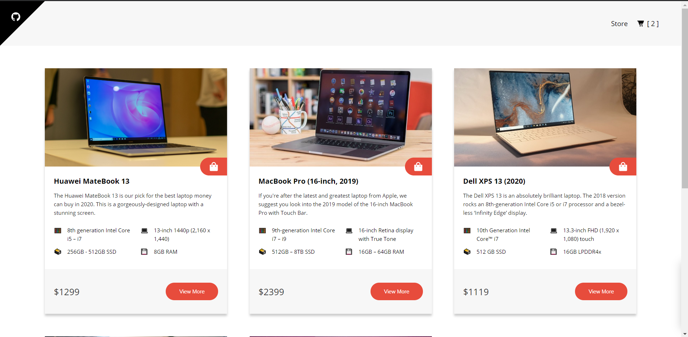

##💻 Laptop Store !!!

### Basic Overview

This is a simple ecommerce store prototype shows how React components and Redux can be used to build a friendly user experience with instant visual updates and scaleable code in ecommerce applications.

#### Features

-   state management with redux
-   Routing with react router
-   Add, remove, clear products from the shopping cart
-   Data persistance with local storage(redux-persist)
-   Responsive design

#### Available Scripts

##### npm start

Runs the app in the development mode.

##### npm test

Launches the test runner in the interactive watch mode.

##### npm run build

Builds the app for production to the `build` folder.
